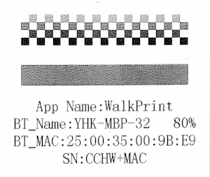
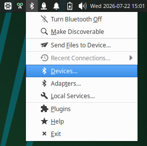
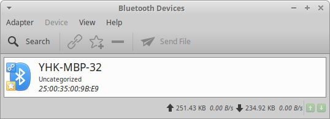
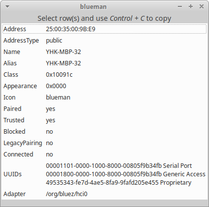

# cat-printer

Print images and text on YHK/Cat Bluetooth thermal printers (tested with the Denver MBP-32B) from the command line or from scripts on Linux.


Cat-printer (YHK-B9AA)


System information print with MAC address A1:D1:E2:00:B9:AA.


Denver MBP-32B (YHK-MBP-32)



System information print with MAC address 25:00:35:00:9B:E9.

## Table of Contents

- [Usage](#usage)
  - [Options](#options)
- [Install](#install)
  - [Configuration](#configuration)
- [Debug](#debug)
- [Credit](#credit)

## Usage

```
cat-printer [OPTIONS] [FILE/TEXT ...]
```

Print plain text:

```bash
cat-printer "Hello, world!"
```

Several words on the command line are joined with a space into one string:

```bash
cat-printer Hello, world.
```

Print an image (JPEG, PNG, and GIF are auto-detected by file content, not by extension). When a text is detected as an existing file it will be treated as a file otherwise as a text:

```bash
cat-printer photo.jpg
```

For the best result, it is recommended to edit the image first with a graphic
tool like [Gimp](https://www.gimp.org/) or the like.
Make the image black and white and scale down to 384 pixels wide.
Color and gray scale images should be diffused with
Floyd–Steinberg dithering, Jarvis, Judice, Ninke or other dithering methods.

Print a text file:

```bash
cat-printer notes.txt
```

Pipe data in on stdin — also auto-detected as image or text:

```bash
cat my-file.txt | cat-printer
cat receipt.png | cat-printer
```

Use `--file` to print several items back-to-back in one job, with no bottom margin between them (only after the last one):

```bash
cat-printer --file=logo.png --file="Order #1234" --file=receipt.txt
```

Use `--` to stop option parsing, so text starting with `-` isn't mistaken for a flag:

```bash
cat-printer -- --this is not an option
```

Check the printer's serial number, product info, and status without printing anything:

```bash
cat-printer --status
```

Example output:

```
Serial number: sn:CCHW250035109BD9.
Product info:  public id:0212.
Status:        HV=H1.0,SV=V1.01,VOLT=7800mv,DPI=384,
```

Get help or the installed version:

```bash
cat-printer --help
cat-printer --version
```

### Options

| Option | Default | Description |
|---|---|---|
| `--mac XX:XX:XX:XX:XX:XX` | — | Bluetooth MAC address of the printer (**required**, here or in the config file). Find it by double-clicking the printer's power button — it prints its own MAC. |
| `--bottom-margin LINES` | `5` | Blank line feeds printed after the last item |
| `--file PATH_OR_TEXT` | — | Image file, text file, or literal text to print. Repeatable. |
| `--font PATH` | `/usr/share/fonts/truetype/dejavu/DejaVuSansMono.ttf` | TrueType font used to render text |
| `--font-size SIZE` | `12` | Font size in points |
| `--port CHANNEL` | `2` | Bluetooth RFCOMM channel |
| `--rotate DEGREES` | `0` | Degrees to rotate image or text |
| `--sleep SECONDS` | `0.5` | Delay between printer commands |
| `--status` | off | Print serial number/product info/status and exit |
| `--verbose` | off | Print progress messages (MAC used, config file found, input source, font, etc.) |
| `--version` | — | Show version and exit |
| `--width PIXELS` | `384` | Printer resolution in pixels |

Command-line options always override the config file; the config file overrides the built-in defaults.

## Install

### Requirements

- Python 3
- [Pillow](https://pypi.org/project/Pillow/)
- A Linux system with Bluetooth/RFCOMM support
- The printer paired over Bluetooth beforehand (e.g. via `bluetoothctl`)

### Steps

```bash
git clone https://github.com/chlordk/cat-printer.git
cd cat-printer
sudo apt-get install python3-pil # Pillow image library
sudo apt install python3-bleak # BLE library
```

Optionally make it available on your `PATH`:

```bash
chmod +x cat-printer
sudo ln -s "$(pwd)/cat-printer" /usr/local/bin/cat-printer
```

### Configuration

The printers MAC address can be found by double-clicking the printer's power button and it prints its own MAC.

The MAC address can also be found by clicking at the Bluetooth icon in the task bar.



Blueman applet.



Blueman applet devices.



Blueman applet devices information.

With `bluez` package installed the MAC address can be found with `hcitool`:

```bash
$ hcitool inq
Inquiring ...
	25:00:35:00:9B:E9	clock offset: 0x7838	class: 0x10091c
```

Look for the class `0x10091c`.

To avoid passing `--mac` (and other options) every time, create `~/.config/cat-printer/config`:

```ini
[printer]
mac = 01:23:45:AB:CD:EF
bottom_margin = 5
font = /usr/share/fonts/truetype/dejavu/DejaVuSansMono.ttf
font_size = 12
port = 2
rotate = 0
sleep = 0.5
width = 384
```

Only `mac` is required; everything else falls back to its built-in default if omitted.

## Debug

Run with `--verbose` to see what the script is doing at each step — which config file (if any) was found, which MAC address is being used, how the input source was detected, which font was loaded, and when the printer connection is closed:

```bash
cat-printer --verbose --status
cat-printer --verbose "Hello, world!"
```

Use `--status` to confirm the Bluetooth connection works and read back the printer's serial number, product info, and firmware/voltage/DPI status without printing anything:

```bash
cat-printer --status
```

Common issues:

- **Printer turned off** — Turn printer on.
- **No MAC address given** — pass `--mac=XX:XX:XX:XX:XX:XX` or set `mac` under `[printer]` in the config file.
- **Connection refused / device not found** — make sure the printer is powered on, paired, and in range; re-pair it with `bluetoothctl` if needed.
- **Garbled or blank output** — try increasing `--sleep`, or double-check `--width` matches your printer's actual resolution.
- **`'...' is neither a JPEG/PNG/GIF image nor a UTF-8 text file`** — the given file isn't a supported image format and also isn't valid UTF-8 text.

## Credit

- 2024 Abhinav Golwalkar — [YHK-Cat-Thermal-Printer](https://github.com/abhigkar/YHK-Cat-Thermal-Printer)
- 2026 Hans Schou — [cat-printer](https://github.com/chlordk/cat-printer)

Licensed under GPLv3.
